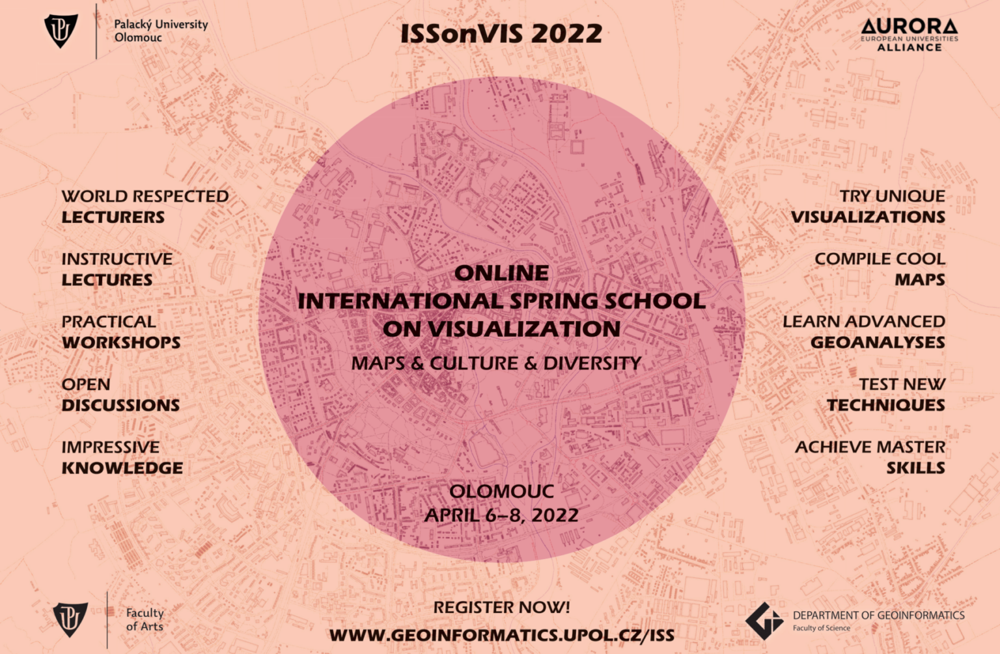

# Online International Spring School on Visualization - Spring 2022
The Online ISSonVis - Maps & Culture & Diversity - 2022 was organized by the Department of Geoinformatics - Palacky University Olomouc, Czech Republic. The main topics were geography and analysis of surnames, maps and culture, maps in literature and history.

The different lectures presented the evolution and importance of maps in European and Russian history, in literature and in American culture. It also highlights the usage that we can have of the maps to study the past or to enjoy and have a better understanding of a piece of art such as a book, a poem or a novel. 

Also, from a GIS point of view, a guided practice on QGIS shown the importance of names and their visualization and analysis.

The benefits of the spring school were the improvement of my historical and literary knowledge. This more artistical point of view is very interesting and opens the discussion on how our predecessors saw the world. It also improved my QGIS basic skills.

------

